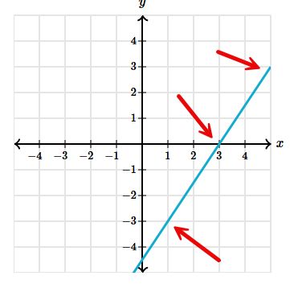

# Khan Academy

## 7th  ([link](https://www.khanacademy.org/math/cc-seventh-grade-math))

| Unit # | Unit Title                                                   |
| ------ | ------------------------------------------------------------ |
| 1      | Proportional relationships ([Khan Academy](https://www.khanacademy.org/math/cc-seventh-grade-math?utm_source=chatgpt.com)) |
| 2      | Rates and percentages ([Khan Academy](https://www.khanacademy.org/math/cc-seventh-grade-math?utm_source=chatgpt.com)) |
| 3      | Integers: addition and subtraction ([Khan Academy](https://www.khanacademy.org/math/cc-seventh-grade-math?utm_source=chatgpt.com)) |
| 4      | Rational numbers: addition and subtraction (and related operations) ([Khan Academy](https://www.khanacademy.org/math/cc-seventh-grade-math?utm_source=chatgpt.com)) |
| 5      | (continued) Rational numbers: multiplication and division, operations with negatives / fractions / decimals ([Khan Academy](https://www.khanacademy.org/math?utm_source=chatgpt.com)) |
| 6      | Expressions, equations & inequalities (pre-algebra basics) ([Khan Academy](https://www.khanacademy.org/math/cc-seventh-grade-math?utm_source=chatgpt.com)) |
| 7      | Statistics and probability ([Khan Academy](https://www.khanacademy.org/math/cc-seventh-grade-math/cc-7th-probability-statistics?utm_source=chatgpt.com)) |

### Unit 2 

#### **Exercise 1: Rates with fractions** (difficult)

1. The mechanics of adding/subtracting fractions and multiplying/dividing fractions.  Review the rationale as to why the mechanics work this way. ([AI conversation](./ai-conversation/fraction-math.md)). Also, this was first covered in [5th-grade math](https://www.khanacademy.org/math/cc-fifth-grade-math).  [Unit 4, Exercise 1](https://www.khanacademy.org/math/cc-fifth-grade-math/imp-fractions-3) has good visuals to support the concepts of adding and subtracting, and why a common denominator is necessary.

1. If two quantities are *proportional*, the constant of proportionality (or slope) can be found by dividing one quantity by the corresponding quantity, even when those values are fractions. The unit rate is simply this constant of proportionality expressed per one unit.

1. Lastly, read the question carefully because the denominator should be expressed usually in time (per minute, hour, etc) or distance (mile, km).

   

#### **Exercise: Rewriting decimals as fractions** (easy)

- Not particularly challenging, as the trick is basically to see that, say, the decimal goes to the hundredths place (e.g., 0.07) and then divide the number by 100 (e.g., 7/100).

- Sal Khan went through the following steps for the problem of expressing 2.75 as a mixed fraction.

  $$
  \begin{aligned}
  &2.75 = 2 + \left(\frac{7}{10} + \frac{5}{100}\right) \\
  &2 + \left(\frac{70}{100} + \frac{5}{100}\right) \\
  &2 + \frac{75}{100} \\
  &2 + \frac{3}{4} \\
  &2\frac{3}{4}
  \end{aligned}
  $$
  
  

- **Exercise: Converting fractions to decimals** (laborious, easy)
  - For this section, come up with the best estimate and then use a calculator.  Getting the answer involves long division, and that is painful.
  - A **prime number** is a whole number greater than 1 whose only factors are one (1) and itself.  Using that idea, we can explain when a fraction will have a **terminating** or **repeating** decimal.  A simplified fraction will have a **terminating decimal** only when the denominator’s prime factors are **2, 5, or both**, because our base-10 system is built from (10 = 2 \times 5).  If the denominator includes **any other prime factor**, the decimal will **repeat**.
- **Exercise: Order Rational Numbers** (moderate)
  - This is a matter of comparing various numbers like fractions, mixed numbers, and decimals, and ordering them.  It’s like a composite of the previous sections to help solidify understanding.  The trick is to convert all to decimal first, then order.

## 8th  ([link](https://www.khanacademy.org/math/cc-eighth-grade-math))

| Number | Title                                       | Exercise link                                                | Difficulty |
| ------ | ------------------------------------------- | ------------------------------------------------------------ | ---------- |
| 8.3.1  | Rates & Proportional Relationships          | [exercise](https://www.khanacademy.org/math/cc-eighth-grade-math/cc-8th-linear-equations-functions/cc-8th-graphing-prop-rel/e/comparing-proportional-relationships) | Moderate   |
| 8.3.2  | Graphing proportional relationships          | [exercise](https://www.khanacademy.org/math/cc-eighth-grade-math/cc-8th-linear-equations-functions/cc-8th-graphing-prop-rel/e/graphing-proportional-relationships) | Moderate   |
| 8.3.3  | Solutions to 2-variable equations          | [exercise](https://www.khanacademy.org/math/cc-eighth-grade-math/cc-8th-linear-equations-functions/8th-solutions-to-two-var-linear-equations/e/plugging_in_values) | Basic   |
| 8.3.4  | Complete solutions to 2-variable equations          | [exercise](https://www.khanacademy.org/math/cc-eighth-grade-math/cc-8th-linear-equations-functions/8th-solutions-to-two-var-linear-equations/e/graphing-solutions-to-two-variable-linear-equations) | Basic   |
| [8.3.5](#8.3.5) | Intercepts from a graph                     | [exercise](https://www.khanacademy.org/math/cc-eighth-grade-math/cc-8th-linear-equations-functions/8th-x-and-y-intercepts/e/linear-function-intercepts) | Easy       |
| 8.3.6  | Intercepts from an equation                 | [exercise](https://www.khanacademy.org/math/cc-eighth-grade-math/cc-8th-linear-equations-functions/8th-x-and-y-intercepts/e/solving_for_the_x-intercept) | Easy       |
| [8.3.7](#8.3.7) | Slope from graph                            | [exercise](https://www.khanacademy.org/math/cc-eighth-grade-math/cc-8th-linear-equations-functions/8th-slope/e/slope-from-a-graph) | Difficult  |
| 8.3.8  | Slope from two points                       | [exercise](https://www.khanacademy.org/math/cc-eighth-grade-math/cc-8th-linear-equations-functions/8th-slope/e/slope-from-two-points) | Easy       |
| 8.3.9  | Slope from equation                         | [exercise](https://www.khanacademy.org/math/cc-eighth-grade-math/cc-8th-linear-equations-functions/8th-slope/e/slope-from-an-equation-in-standard-form) |            |
| 8.3.14 | Evaluate functions                          | [exercise](https://www.khanacademy.org/math/cc-eighth-grade-math/cc-8th-linear-equations-functions/8th-functions-and-function-notation/e/evaluate-functions) | Basic      |
| 8.3.15 | Evaluate functions from their graph         | [exercise](https://www.khanacademy.org/math/cc-eighth-grade-math/cc-8th-linear-equations-functions/8th-functions-and-function-notation/e/evaluate-functions-from-graph) | Basic      |
| 8.3.16 | Function rules from equations               | [exercise](https://www.khanacademy.org/math/cc-eighth-grade-math/cc-8th-linear-equations-functions/8th-functions-and-function-notation/e/function-rules-from-equations) | Easy       |
| 8.3.17 | Linear equations word problems: graphs      | [exercise](https://www.khanacademy.org/math/cc-eighth-grade-math/cc-8th-linear-equations-functions/8th-linear-functions-modeling/e/interpreting-linear-graphs) | Moderate   |
| 8.3.22 | Graphing linear relationships word problems | [exercise](https://www.khanacademy.org/math/cc-eighth-grade-math/cc-8th-linear-equations-functions/constructing-linear-models-real-world/e/graphing-linear-functions-word-problems) | Difficult  |
| 8.3.22 | Comparing linear functions word problems    | [exercise](https://www.khanacademy.org/math/cc-eighth-grade-math/cc-8th-linear-equations-functions/compare-linear-fuctions/e/comparing-features-of-functions-1) | Moderate   |
| 8.3.23 | Writing linear functions word problems      | [exercise](https://www.khanacademy.org/math/cc-eighth-grade-math/cc-8th-linear-equations-functions/constructing-linear-models-real-world/e/writing-linear-functions-word-problems) | Moderate   |
| 8.3.24 | Recognize functions from tables             | [exercise](https://www.khanacademy.org/math/cc-eighth-grade-math/cc-8th-linear-equations-functions/cc-8th-function-intro/e/recognizing_functions) | Easy       |
| 8.3.25 | Recognize functions from graphs             | [exercise](https://www.khanacademy.org/math/cc-eighth-grade-math/cc-8th-linear-equations-functions/cc-8th-function-intro/e/recog-func-2) | Easy       |
| 8.3.26 | Linear & nonlinear functions                | [exercise](https://www.khanacademy.org/math/cc-eighth-grade-math/cc-8th-linear-equations-functions/linear-nonlinear-functions-tut/e/linear-non-linear-functions) | Easy       |
| 8.3.27 | Interpreting graphs of functions            | [exercise](https://www.khanacademy.org/math/cc-eighth-grade-math/cc-8th-linear-equations-functions/linear-nonlinear-functions-tut/e/interpreting-graphs-of-linear-and-nonlinear-functions) | Difficult  |

#### 8.3.1 Rates & Proportional Relationships ([exercise](https://www.khanacademy.org/math/cc-eighth-grade-math/cc-8th-linear-equations-functions/cc-8th-graphing-prop-rel/e/comparing-proportional-relationships), moderate)

- This involves determining the proportional relationships in each example and comparing them.  It takes thought.  They use tables, graphs, and formulas.  The trick is first to identify the independent and dependent rates of change, and then to divide the independent by the dependent to find the proportional relationship.  We do the same for any other items presented in the problem, and compare.

#### 8.3.2 Graphing proportional relationships ([exercise](https://www.khanacademy.org/math/cc-eighth-grade-math/cc-8th-linear-equations-functions/cc-8th-graphing-prop-rel/e/graphing-proportional-relationships), moderate)

- This section may provide the slope and then ask you to graph it.  It may also require you to write the equation representing the line.

#### 8.3.3 Solutions to 2-variable equations ([exercise](https://www.khanacademy.org/math/cc-eighth-grade-math/cc-8th-linear-equations-functions/8th-solutions-to-two-var-linear-equations/e/plugging_in_values), easy)

- Its a matter of plugging in the values for $$x$$ and $$y$$ into the equation and seeing if the ordered pair works.

#### 8.3.4 Complete solutions to 2-variable equations ([exercise](https://www.khanacademy.org/math/cc-eighth-grade-math/cc-8th-linear-equations-functions/8th-solutions-to-two-var-linear-equations/e/graphing-solutions-to-two-variable-linear-equations), easy)

- Rearrange the terms and solve for $$x$$ or $$y$$ based on which one is given.

---

#### <a name='8.3.5'>8.3.5 Intercepts from a graph</a> ([exercise](https://www.khanacademy.org/math/cc-eighth-grade-math/cc-8th-linear-equations-functions/8th-x-and-y-intercepts/e/linear-function-intercepts), easy)

- When dealing with x- and y-intercepts, the y- and x-coordinates are 0, respectively, in the ordered pair.  Set it to 0, then examine each intercept and obtain the values of $$x$$ and $$y$$.

#### 8.3.6 Intercepts from an equation ([exercise](https://www.khanacademy.org/math/cc-eighth-grade-math/cc-8th-linear-equations-functions/8th-x-and-y-intercepts/e/solving_for_the_x-intercept), easy)

- Like the last section, when dealing with x- and y-intercepts, the y- and x-coordinates are 0, respectively, in the ordered pair.  As such, to determine the answers to the two-variable questions given, we know that either x or y is 0, depending on the intercept in question.
  $$
  \begin{aligned}
  -5x - 4y = 10\\
  \text{y-intercept} (?,?)\\
  \text{x-intercept} (?,?)\\
  \end{aligned}
  $$

#### <a name='8.3.7'>8.3.7 Slope from graph</a> ([exercise](https://www.khanacademy.org/math/cc-eighth-grade-math/cc-8th-linear-equations-functions/8th-slope/e/slope-from-a-graph), difficult)

- Pick 2 points on the graph that are pure whole numbers and subtract.  Remember, slope is rise ($$\Delta{y}$$) / run ($$\Delta{x}$$), so that implies the order of the pairs to subtract from one another.  In other words, if point B is higher than point A, you are subtracting the x and y coordinates of point B from those of point A.  One way to verify the answer is to determine whether you obtain the same slope for another set of points.

We have 3 points to use.

A. `( 1, -3 )`
B. `( 3,  0 )`
C. `( 5,  3 )`

The slope from point C to point B is $$\frac{3}{2}$$.  Why start at C?  Because it’s higher.  Likewise, the slope from point B to A is $$\frac{3}{2}$$

#### 8.3.8 Slope from two points ([exercise](https://www.khanacademy.org/math/cc-eighth-grade-math/cc-8th-linear-equations-functions/8th-slope/e/slope-from-two-points), easy)

- Take the two coordinates, determine $$\Delta{y}$$ and $$\Delta{x}$$, and take the ratio of $$\frac{\Delta y}{\Delta x}$$.
  $$
  \begin{aligned}
  (-9,6)\space\text{and}\space(-6,-9)\\
  \Delta{x} = -6 - (-9) = 3\\ 
  \Delta{y} = -9 - 6 = -15\\
  \frac{\Delta y}{\Delta x} = \frac{-15}{3} = -5
  \end{aligned}
  $$
  

#### 8.3.9 Slope from equation ([exercise](https://www.khanacademy.org/math/cc-eighth-grade-math/cc-8th-linear-equations-functions/8th-slope/e/slope-from-an-equation-in-standard-form))

---

#### 8.3.14 Evaluate functions ([exercise](https://www.khanacademy.org/math/cc-eighth-grade-math/cc-8th-linear-equations-functions/8th-functions-and-function-notation/e/evaluate-functions), basic)

- Plug in $$x$$ to solve for $$y$$.  Cannot get easier.

#### 8.3.15 Evaluate functions from their graph ([exercise](https://www.khanacademy.org/math/cc-eighth-grade-math/cc-8th-linear-equations-functions/8th-functions-and-function-notation/e/evaluate-functions-from-graph), basic)

- Very easy.  Find the value of $$y$$ on the graph given $$x$$.

#### 8.3.16 Function rules from equations ([exercise](https://www.khanacademy.org/math/cc-eighth-grade-math/cc-8th-linear-equations-functions/8th-functions-and-function-notation/e/function-rules-from-equations), easy)

- Identify the independent variable and rearrange the equation so it appears on one side.

#### 8.3.17 Linear equations word problems: graphs ([exercise](https://www.khanacademy.org/math/cc-eighth-grade-math/cc-8th-linear-equations-functions/8th-linear-functions-modeling/e/interpreting-linear-graphs), moderate)

- This involves finding two points on the graph, calculating the slope ($$\frac{\Delta y}{\Delta x}$$), and then logically answering the question.

#### 8.3.22 Graphing linear relationships word problems ([exercise](https://www.khanacademy.org/math/cc-eighth-grade-math/cc-8th-linear-equations-functions/constructing-linear-models-real-world/e/graphing-linear-functions-word-problems), difficult)

- They give you a point on the graph, and then you have to derive the second point from the first, given the slope.

#### 8.3.22 Comparing linear functions word problems ([exercise](https://www.khanacademy.org/math/cc-eighth-grade-math/cc-8th-linear-equations-functions/compare-linear-fuctions/e/comparing-features-of-functions-1), moderate)

- 

#### 8.3.23 Writing linear functions word problems ([exercise](https://www.khanacademy.org/math/cc-eighth-grade-math/cc-8th-linear-equations-functions/constructing-linear-models-real-world/e/writing-linear-functions-word-problems), moderate)

- Really need to read the problem.

#### 8.3.24 Recognize functions from tables ([exercise](https://www.khanacademy.org/math/cc-eighth-grade-math/cc-8th-linear-equations-functions/cc-8th-function-intro/e/recognizing_functions), easy)

- The trick is to ensure that, given a value of x, there are not multiple values for y.

#### 8.3.25 Recognize functions from graphs ([exercise](https://www.khanacademy.org/math/cc-eighth-grade-math/cc-8th-linear-equations-functions/cc-8th-function-intro/e/recog-func-2), easy)

- The trick is to look at the graph and see if there can be multiple values of y for a given value of x.  This occurs when the line is vertical.

#### 8.3.26 Linear & nonlinear functions ([exercise](https://www.khanacademy.org/math/cc-eighth-grade-math/cc-8th-linear-equations-functions/linear-nonlinear-functions-tut/e/linear-non-linear-functions), easy)

- Relatively easy when the problems involve graphs.  Basically, anything that is not a continuous line is not linear.  When the problem involves tables, calculate the slope and if constant then linear.

#### 8.3.27 Interpreting graphs of functions ([exercise](https://www.khanacademy.org/math/cc-eighth-grade-math/cc-8th-linear-equations-functions/linear-nonlinear-functions-tut/e/interpreting-graphs-of-linear-and-nonlinear-functions), difficult)

- This concerns the interpretation of the graph.  It's an essential skill, but I’m not sure if it’s on the exam.
